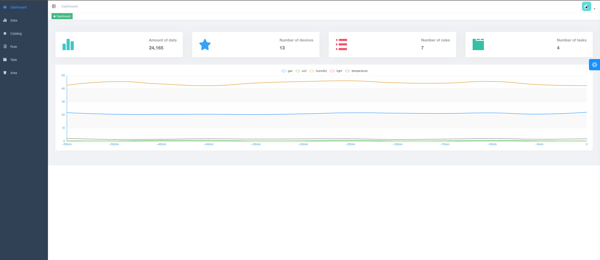

# Smart Garden IoT 🌱
*Automated Gardening with IoT Technology*

---
## 🔗 Repositories
- **[Frontend Code](https://github.com/SaltedFishQAQ/smart_garden_iot_frontend)** (Current Repository)
- **[Backend Code](https://github.com/SaltedFishQAQ/smart_garden_iot)**

---
### University
Politecnico di Torino / Polytechnic University of Turin


### Course
Master of Science program in ICT for Smart Societies

01QWRBH - Programming for IoT applications


---
## 📖 Introduction
The IoT Smart Gardening System is an advanced solution designed to automate and optimize garden maintenance tasks using data collected from environmental sensors. By automating irrigation, lighting, and environmental control, the system enhances plant care through intelligent decision-making, allowing users to remotely monitor and control their gardens in real-time.

---
## 🚀 Features
- **Real-time Data Collection**: Monitor soil moisture, temperature, humidity, and light intensity using sensors.
- **Automated Watering System**: Smart irrigation based on soil conditions and weather forecasts.
- **Custom Rules & Schedules**: Set up personalized rules for watering, lighting, and alerts.
- **Interactive Dashboard & Telebot**: Access garden data and control devices through a web interface or telebot.
- **Data-Driven Decisions**: Receive actionable insights and recommendations for optimal garden care.

---
## 🛠️ Technology Stack
### Hardware (optional)
> You can use the device service instead of the Raspberry Pi
- **Raspberry Pi**: The central controller for processing sensor data and executing commands.
- **Sensors**: Soil moisture, temperature, light, and humidity sensors.
- **Actuators**: Irrigator, oxygen valve, and light switch.

### Software
- **Mosquitto**: Acts as the MQTT broker, facilitating communication between IoT devices and the backend.
- **Cherrypy**: Provides the lightweight web framework for hosting the backend API and managing automation logic.
- **InfluxDB**: Used for storing time-series data, such as sensor readings, to support real-time monitoring and analysis.
- **MySQL**: Manages user data, device configurations, and automation rules in a relational database format.
- **Element-Plus(Vue.js)**: Powers the frontend UI components, enabling a clean, responsive, and interactive user experience.

---
## 📦 Installation
### 1. Clone the Repository
```shell
git clone https://github.com/SaltedFishQAQ/smart_garden_iot.git
git clone https://github.com/SaltedFishQAQ/smart_garden_iot_frontend.git
```
### 2. Start the [Backend Server](https://github.com/SaltedFishQAQ/smart_garden_iot)
```shell
cd smart_garden_iot
docker-compose up --build -d
```
### 3. Start the Frontend Server
```shell
cd ../smart_garden_iot_frontend
npm run build:prod
```
---
## 🖥️ Usage
Access the web dashboard:
1. Default URL: http://localhost:9527/
2. View live sensor data and control your garden devices.
3. Configure automation rules and schedules.


---
## ✍️ Teams
- Wenxi Lai
- Davood Shaterzadeh
- Nasrin Hayati Nejad

---
## License
[Apache-2.0 license](LICENSE)


